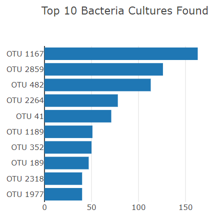
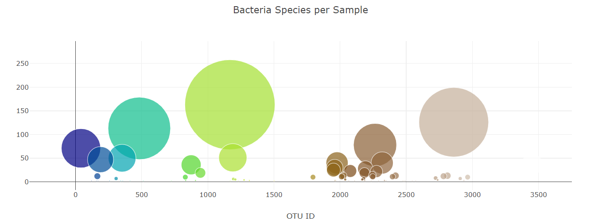
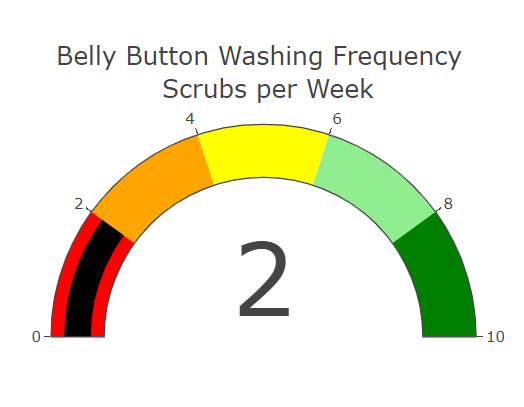

# Plotly_Deployment
You can find the analysis files here: [charts.js](https://github.com/NedaAJ/Plotly_Deployment/blob/main/statics/js/charts.js) | [index.html](https://github.com/NedaAJ/Plotly_Deployment/blob/main/index.html)

## Overview of Analysis

## Results

## Contact:
- Email : [neda.ahmadi.jesh@gmail.com](mailto:neda.ahmadi.jesh@gmail.com?subject=[GitHub]%20Source%20Han%20Sans)
- Linkedin: www.linkedin.com/in/neda-ahmadi-j
