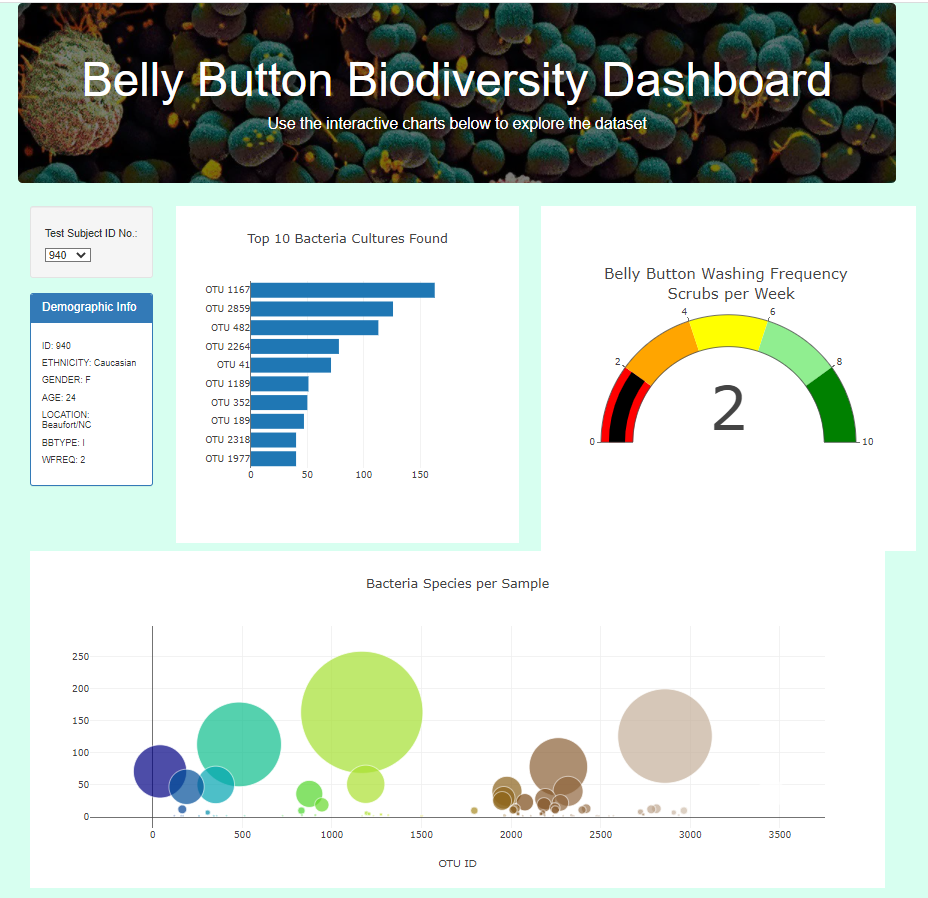

# Plotly_Deployment
You can find the analysis files here: [charts.js](https://github.com/NedaAJ/Plotly_Deployment/blob/main/statics/js/charts.js) | [index.html](https://github.com/NedaAJ/Plotly_Deployment/blob/main/index.html)

## Overview of Analysis
Improbable Beef is seeking to create bacteria that can be used to create a synthetic beef substitute. If Improbable Beef finds an acceptable bacterial species, we'll use their volunteer's data to see if the discovered species is present in one or more of volunteer's belly buttons.

I constructed an HTML/JavaScript page that shows a customised dashboard with a bar chart, a bubble chart, and a gauge chart meant to identify various types of bacteria to assist the client visualise their data. The user selects the volunteer's ID number from the left-hand drop-down menu, and all of the volunteer's information is immediately shown on the page. Static data is used to filter the dashboard.

## Results

The bubble chart is a visual representation of the top ten bacterial species found in the participants' belly buttons. The gauge indicates how many times a volunteer cleaned their belly button while volunteering.

## Contact:
- Email : [neda.ahmadi.jesh@gmail.com](mailto:neda.ahmadi.jesh@gmail.com?subject=[GitHub]%20Source%20Han%20Sans)
- Linkedin: www.linkedin.com/in/neda-ahmadi-j
